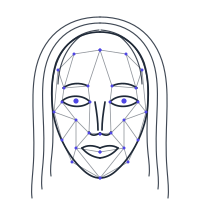

<p align="center">
  <picture>
    <source media="(prefers-color-scheme: dark)" srcset="assets/ira-dark.svg">
    
  </picture>
</p>

<h1 align="center">IRA</h1>

Duplex voice loop prototype for IRA. Wake word → VAD endpointing → STT → streaming
LLM → streaming TTS, with barge-in.

This exists to answer one question before anything else gets built: **does talking
to it feel right?** If the turn-taking is wrong or the latency is bad, no amount of
tools, memory or UI fixes it. Everything else in IRA is comparatively routine.

## Run

```powershell
.\scripts\fetch-models.ps1
$env:ANTHROPIC_API_KEY = "sk-ant-..."
$env:GROQ_API_KEY = "gsk_..."
cargo run --release
```

Say **"hey Jarvis"**, wait for the chirp, talk. Interrupt her any time.

> **Wear headphones.** There is no acoustic echo cancellation yet, so on speakers
> the mic hears IRA's own voice and she interrupts herself in a loop. This is the
> single biggest gap between this prototype and something you can ship.

## Wiring

```
mic ─┬─ openWakeWord ──── Idle: is that the wake word?
     ├─ Silero VAD ────── Listening: has the user stopped? (700 ms)
     │                    Holding:   has the user started? (250 ms → barge-in)
     └─ utterance buffer ─► Groq Whisper ─► Claude (streaming)
                                                │ sentence at a time
                                                ▼
                                          Piper ─► rodio  (clear() = instant silence)
```

| File | Job | Becomes |
|---|---|---|
| `audio.rs` | cpal capture, downmix, 16 kHz resample | `ira-audio` |
| `wake.rs` | openWakeWord 3-model chain | `ira-wake` |
| `vad.rs` | Silero v5, endpointing + barge-in | `ira-vad` |
| `stt.rs` | Groq Whisper | `ira-stt` (lift Echo's local path in) |
| `llm.rs` | Anthropic/OpenAI stream → sentences | `ira-brain` (Wingman as a library) |
| `tts.rs` | Piper subprocess + rodio | `ira-tts` |
| `main.rs` | state machine | `ira-daemon` |

## Docs

[docs/INDEX.md](docs/INDEX.md) is the map. In reading order:
[PRD](docs/PRD.md) (what and why) &middot;
[ROADMAP](docs/ROADMAP.md) (ten phases to v1.0) &middot;
[ARCHITECTURE](docs/ARCHITECTURE.md) (how, and why it is shaped this way) &middot;
[SPEC](docs/SPEC.md) (implementable detail) &middot;
[TEST-PLAN](docs/TEST-PLAN.md) (how we know it works).

Decisions are recorded individually under [docs/decisions/](docs/decisions/) --
including the ones that were rejected, and what would change them.

## Knobs

Everything worth tuning is a `const` at the top of `main.rs`. Tune by ear, not by
theory — these numbers are starting guesses, not measurements.

| Const | Default | Symptom if wrong |
|---|---|---|
| `ENDPOINT_MS` | 700 | Too low: cuts you off mid-thought. Too high: feels sluggish. |
| `BARGE_IN_MS` | 250 | Too low: a cough stops her. Too high: interrupting feels laggy. |
| `BARGE_IN_GRACE_MS` | 300 | Too low: the tail of your question interrupts its own answer. |
| wake threshold | 0.5 | Too low: fires on the TV. Too high: you repeat yourself. |

Env overrides: `IRA_MODELS`, `IRA_WAKEWORD`, `IRA_VOICE`, `IRA_PIPER`,
`IRA_STT_URL`, `IRA_LLM_URL`, `IRA_LLM_KEY`, `IRA_LLM_MODEL`.

## OpenRouter, or any OpenAI-compatible brain

Anthropic direct is the default. `IRA_LLM_URL` switches to the OpenAI
chat-completions format, which OpenRouter, LM Studio, Ollama, vLLM and
llama.cpp all speak:

```powershell
$env:IRA_LLM_URL   = "https://openrouter.ai/api/v1/chat/completions"
$env:IRA_LLM_KEY   = "sk-or-..."
$env:IRA_LLM_MODEL = "anthropic/claude-sonnet-4.5"   # OpenRouter's id, not Anthropic's
```

`ANTHROPIC_API_KEY` is then unused. `IRA_LLM_MODEL` is required here because
every gateway names models differently; `IRA_LLM_KEY` is not, since a local
server generally wants no key.

Whatever the model, keep it fast. Time-to-first-sentence is what you hear -- a
reasoning model that thinks for four seconds before its first token feels broken
in a voice loop no matter how good the answer is.

## Local STT

whisper.cpp's `whisper-server` speaks the same multipart API as Groq, so going
offline is a URL rather than a code path:

```powershell
.\scriptsetch-models.ps1 -Whisper
```

Opt-in, because it is a bigger download than everything else here combined. It
reads `nvidia-smi` and picks the build to match: an NVIDIA driver gets the
cuBLAS 11.8 pack and `small.en`, anything else gets the CPU pack and `tiny.en`.
Override either with `-Backend` / `-Model`. It prints the two lines to run:

```powershell
.\whisper\whisper-server.exe -m .\models\ggml-small.en.bin --host 127.0.0.1 --port 8231
$env:IRA_STT_URL = "http://127.0.0.1:8231/inference"
```

CUDA is backward compatible, so the 11.8 pack runs on a 12.x driver at the same
speed for a tenth of the download. Cards newer than CUDA 11.8 (Blackwell) need
`-Backend cuda12`.

`GROQ_API_KEY` is then unused. Measured on 8 CPU cores against 2.8 s of speech:

| Engine | Latency | Notes |
|---|---|---|
| Groq `whisper-large-v3-turbo` | — | Fast, but needs the network and sends your voice off the machine |
| `tiny.en`, 8 threads | ~750 ms | Offline. Fine on clear speech, drops proper nouns |
| `base.en`, 8 threads | ~1.5 s | Noticeably sluggish in the loop |

That latency sits directly in the gap between you stopping and IRA starting, so
pick by ear. On a CUDA machine the same server with a GPU build erases the gap;
this box has integrated graphics, so the numbers above are CPU-only.

## Deliberate shortcuts

Each is marked with a `ponytail:` comment at the site.

| Shortcut | Ceiling | Upgrade when |
|---|---|---|
| No AEC, headphones assumed | Unusable on speakers | Before any demo not wearing headphones — `webrtc-audio-processing` |
| Groq STT by default | Not private, dies offline | Set `IRA_STT_URL` -- local costs ~750 ms on CPU |
| Cheap linear resampler | Slight aliasing | Only if measured word-error-rate suffers |
| Piper respawn on barge-in | ~250 ms before she can speak again | If interruption recovery feels slow — keep a warm spare |
| Fixed 8-turn history window | No real memory | Wire up kortex-memory |
| VAD-only endpointing | Cuts off mid-thought pauses | Add a semantic turn model (smart-turn v2) |

## Wake word

`hey_jarvis` is a pretrained openWakeWord model, used here so the prototype runs
today. A real "IRA" model is a Colab training run against the same three-stage
chain — only `hey_jarvis_v0.1.onnx` changes, no code does.

openWakeWord is Apache-2.0 and free commercially. Porcupine has a built-in
"jarvis" keyword and is far less code, but its commercial licensing does not fit
the plan.

## Tests

`cargo test` — 10 tests, no network or mic needed.

Two run the real ONNX models and are the ones that matter: they check the tensor
shapes threaded through openWakeWord's three stages and Silero's recurrent state
carry. Get one wrong and you find out here instead of at 3am. They skip with a
note if `models/` is empty, so a fresh clone still passes.

The rest cover what silently corrupts audio: resampler ratio, WAV header, and
sentence splitting (which must not break on `3.50`).

One more skips unless `IRA_STT_URL` points at a running whisper-server: it
checks that a local engine accepts the WAV bytes `stt.rs` writes, which is the
one thing a URL swap cannot be assumed to get right.

The loop itself is tuned by talking to it — there is no test for "feels right".

**Wake latency floor:** openWakeWord needs ~2.2 s of audio in its window before
the classifier can fire at all (76 mel frames to the first embedding, then 16
embeddings at 80 ms). In use the window is always full, so this only shows up in
the first couple of seconds after start-up.
